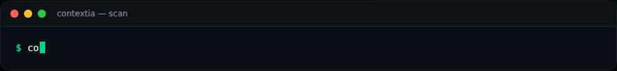
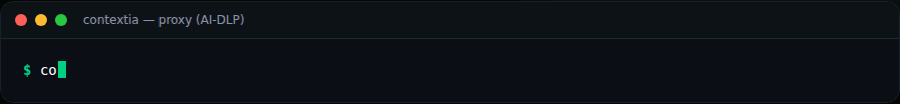

<p align="center">
  
</p>

# Contextia

**Keep secrets out of AI.** Contextia catches API keys, tokens, private keys and
other credentials *before* they reach an AI assistant — in your terminal and in
your browser. Everything runs on-device.

[](https://github.com/sbr0nch/contextia/actions/workflows/ci.yml)
[](https://www.npmjs.com/package/@sbr0nch/contextia)
[](./LICENSE)
[](#privacy)

> A safety net, not a guarantee. Detection is rule-based and can miss things —
> treat it as a guardrail, not proof that a paste is clean.

---

## Terminal (CLI + AI-DLP proxy)

```bash
npm i -g @sbr0nch/contextia
```

Scan files or a diff for secrets, with a plain-language reason for each hit:



Or run it as a **local proxy** between your AI agent and the LLM — it redacts (or
blocks) secrets before the request leaves your machine, and never sends anything
anywhere else:



```bash
contextia proxy --mode redact
ANTHROPIC_BASE_URL=http://localhost:8787 claude   # point your agent at it
#   live stats at http://localhost:8787/__contextia
```

`--reversible` swaps each secret for a local token and restores the originals in
the model's reply, so the answer stays usable while the real value never leaves.

## Browser extension

Live detection in the chat composer on **chatgpt.com** and **claude.ai**: findings
are underlined inline, with Redact / Allow once / Allow all / Allow pattern, and
modes for Warn, Auto-redact, Block, or Off. Build it from `packages/extension`
(`npm run build`) and load `dist/` unpacked, or install from the browser stores.

## What it detects

40+ credential types — AWS, GitHub, GitLab, Stripe, Slack, OpenAI, Anthropic,
Google, Azure, Twilio, SendGrid and more — plus PEM private keys, `.env` secrets,
database connection strings, JWTs, and personal data like Luhn-valid credit-card
numbers and IBANs. Add your own values/patterns to always redact.

## Privacy

The browser extension makes **zero network requests** — no accounts, servers,
analytics or telemetry. The proxy only forwards your agent's own request to the
LLM API it was already calling. A local detections log never stores the matched
secret value. Full policy: [`PRIVACY.md`](./PRIVACY.md).

## Architecture

npm workspace, three packages:

| Package | What it is |
|---|---|
| `@sbr0nch/contextia-engine` | The detection core. Pure functions, no DOM, no network, dependency-light. |
| `@sbr0nch/contextia` | The terminal CLI + AI-DLP proxy. |
| extension | The Manifest V3 browser extension. |

The engine is environment-agnostic so every surface reuses it without a rewrite.

```bash
npm install
npm run verify   # typecheck + tests (100% engine coverage) + acceptance + build
```

## License

[MIT](./LICENSE). Third-party rule patterns and their licenses are recorded in
[`NOTICE`](./NOTICE). Security policy: [`SECURITY.md`](./SECURITY.md).
